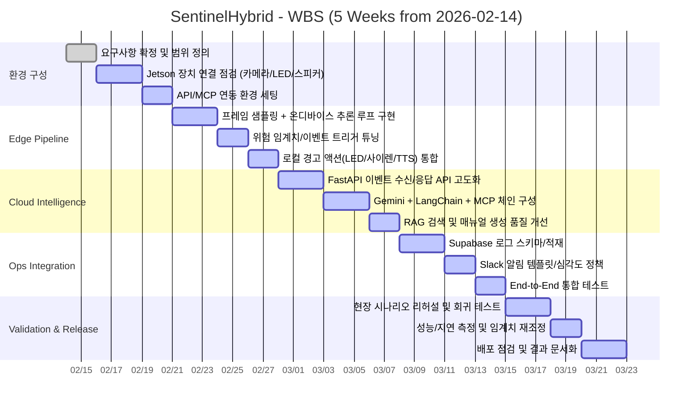

<div align="center">

# SentinelHybrid

> **Jetson Orin Nano 기반 하이브리드 실시간 위험 감지 대응 시스템**  
> **On-device Safety + Cloud RAG Intelligence**

<br/>
</div>


SentinelHybrid는 현장에서 즉시 반응하는 **온디바이스 안전 대응**과, 클라우드에서 지식기반으로 정교하게 대응하는 **RAG 인텔리전스**를 결합한 안전 시스템입니다.

카메라 입력을 Jetson Orin Nano에서 실시간 분석하고, 위험 상황일 때만 서버와 연동해 대응 매뉴얼 생성, 로그 적재, 슬랙 알림, 음성 안내까지 자동으로 수행합니다.

---

## 1. 프로젝트 목표

기존 영상 감지 시스템은 `감지`에서 끝나는 경우가 많습니다.  
SentinelHybrid는 감지 이후의 **실제 대응 단계**까지 자동화합니다.

- 현장 경고: LED 점멸, 사이렌, 안내 음성
- 서버 대응: 상황 해석, RAG 기반 매뉴얼 생성
- 운영 연계: 로그 저장, Slack 전파, 추후 분석

즉, "위험을 찾는 시스템"이 아니라 "**위험에 대응하는 시스템**"을 목표로 합니다.

---

## 2. 전체 아키텍처

<p align="center">
  
</p>

> Jetson 온디바이스 추론과 FastAPI + MCP + RAG 클라우드 대응 체계를 하나의 파이프라인으로 통합합니다.

---

## 3. 핵심 동작 파이프라인

1. Jetson에 연결된 카메라에서 프레임 입력을 받습니다.
2. 일정 프레임 간격으로 온디바이스 VLM 추론을 수행합니다.
3. 위험 상황으로 판단되면 Jetson이 즉시 로컬 대응을 시작합니다.
4. 동시에 상황 설명 텍스트를 FastAPI 서버로 전송합니다.
5. 서버는 Gemini + MCP + RAG를 통해 상황별 대응 매뉴얼을 생성합니다.
6. 생성된 매뉴얼은 Jetson으로 다시 전달됩니다.
7. Jetson은 스피커를 통해 대응 문장을 음성으로 안내합니다.
8. 서버는 동일 이벤트를 Supabase에 기록하고 Slack으로 전파합니다.

---

## 4. 왜 하이브리드인가?

### On-device (Jetson) 역할
- 네트워크 상태와 무관하게 즉시 위험 감지/경고
- 지연이 치명적인 순간에 빠른 1차 대응

### Cloud (FastAPI + RAG) 역할
- 상황 맥락 기반 판단 고도화
- 매뉴얼/정책/히스토리 기반 대응 지시 생성
- 운영 시스템(Slack, 로그 저장소)과 연동

### 결론
- **속도는 Edge**, **지식과 확장성은 Cloud**에서 담당
- 현장성과 운영성을 동시에 확보

---

## 5. 기술 스택

| 영역 | 기술 (Stack) | 상세 |
|:---:|:---|:---|
| **Edge Device** |  | NVIDIA Jetson Orin Nano (8GB) |
| **Vision Inference** |  | On-device VLM (Gemma 3 4B) |
| **Backend API** |  | Python async server |
| **Language** |  | Python 3.12 |
| **LLM Reasoning** |  | Cloud reasoning |
| **Orchestration** |  | Agent orchestration |
| **Context Protocol** |  | Model Context Protocol |
| **RAG** |   | Vector DB (MCP) |
| **Logging** |  | Logging/DB (MCP) |
| **Alerting** |  | Real-time alerting(MCP) |
| **Local Response** | `LED` `Siren` `TTS Speaker` | Local actuators (GPIO/USB Audio) |

---

## 6. MCP 기반 확장 포인트

SentinelHybrid는 MCP를 통해 외부 도구를 "호출 가능한 컨텍스트"로 표준화해 연결합니다.

- **RAG MCP**: 상황 문맥에 맞는 대응 절차 검색/요약
- **Supabase MCP**: 사건 로그 저장, 이력 조회, 사후 분석 데이터 축적
- **Slack MCP**: 관리자/운영 채널에 실시간 전파 및 협업 대응

이 구조를 사용하면 도구를 교체하거나 추가할 때도 핵심 파이프라인 변경을 최소화할 수 있습니다.

---

## 프로젝트 구조

아래는 현재 프로젝트의 디렉토리 구조입니다.

```text
SentinelHybrid/
├── README.md
├── requirements.txt
├── data/
│   └── events/                  # 위험 이벤트/응답 JSONL 로그
├── src/
│   ├── api/                    # FastAPI API + 관리자 대시보드 정적 파일
│   │   ├── services/           # MCP/Local RAG + LLM 응답 파이프라인
│   │   └── static/admin/       # 관리자 UI (HTML/CSS/JS)
│   ├── edge/                   # Jetson/로컬 추론 루프 + 경고 제어 + 서버 전송
│   ├── mcp/                    # FastMCP 기반 RAG 서버
│   ├── rag/                    # 기본 안전 매뉴얼 및 로컬 검색 유틸
│   └── sim/                    # 위험 이벤트 시뮬레이터
```

---

## 프로젝트 실행 및 테스트

```bash
# 1) 가상환경/패키지 설치
uv sync

# 2) 환경 변수 파일 준비 (.env)
cp .env.example .env

# 3) Edge 파이프라인 실행 (Jetson)
python -m src.edge.main

# 4) FastAPI 서버 실행
uvicorn src.api.main:app --host 0.0.0.0 --port 8000

# 5) 테스트 실행
pytest -q
```

```text
관리자 대시보드: http://127.0.0.1:8000/admin
API 문서:        http://127.0.0.1:8000/docs
```

시뮬레이터 위험 시나리오 테스트:
```bash
python src/sim/send_mock_danger_event.py --count 5 --interval 2 --scenario mixed
# 또는 --scenario fire / fall / intrusion / electrical
```


---

## WBS Gantt Chart (5 Weeks)


